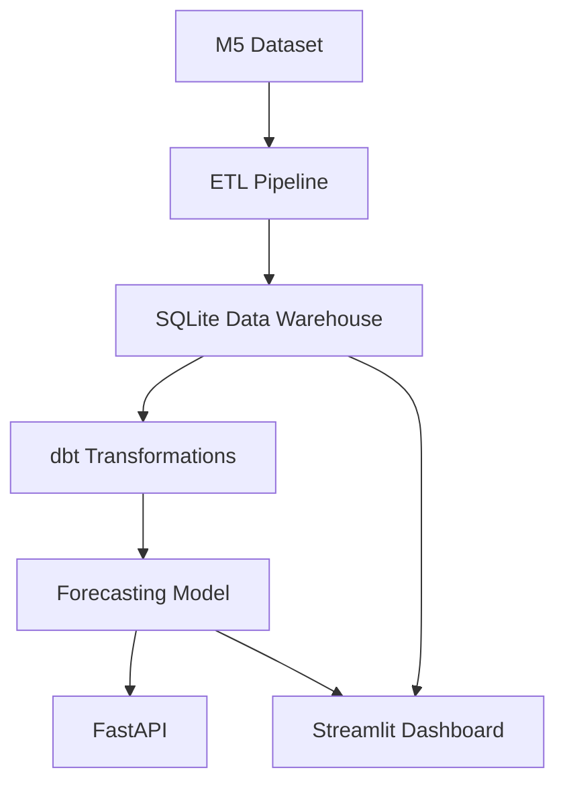

# Retail Demand Forecasting Architecture

```mermaid
flowchart TD
    A[M5 Dataset] --> B[ETL Pipeline]
    B --> C[SQLite Data Warehouse]
    C --> D[dbt Transformations]
    D --> E[Forecasting Model]
    E --> F[FastAPI]
    E --> G[Streamlit Dashboard]
    C --> G
```