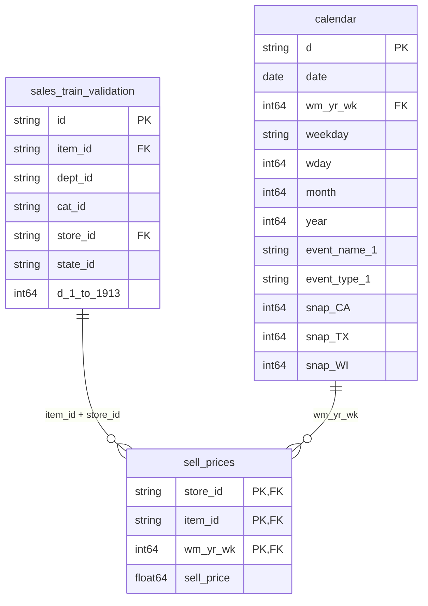

# 📖 M5 Dataset Data Dictionary & Data Warehouse Schema Design

This document details the structures of the M5 Forecasting Dataset and the corresponding Google BigQuery raw data warehouse schema designed to store them.

---

## 🗄️ Raw Datasets Overview

The dataset consists of four main files, representing daily unit sales, calendar parameters, and weekly item prices.

| File Name | Row Count | Column Count | Primary Key | Business Meaning |
|---|---|---|---|---|
| `sales_train_validation.csv` | 30,490 | 1,919 | `id` | Historical daily unit sales per item/store (d_1 to d_1913) |
| `calendar.csv` | 1,969 | 14 | `d` (or `date`) | Date metadata: day number, calendar date, holidays, events, SNAP indicators |
| `sell_prices.csv` | 6,841,121 | 4 | `(store_id, item_id, wm_yr_wk)` | Weekly selling price per product/store |
| `sample_submission.csv` | 60,980 | 29 | `id` | Template for model predictions (forecast of 28 future days) |

---

## 📊 Dataset Schema Details

### 1. Sales Dataset (`sales_train_validation.csv`)
Contains historical unit sales for each item in each store.

*   **`id`** *(STRING)*: Unique identifier of the product-store combination (e.g., `HOBBIES_1_001_CA_1_validation`).
*   **`item_id`** *(STRING)*: Unique identifier of the product (e.g., `HOBBIES_1_001`).
*   **`dept_id`** *(STRING)*: Department category (e.g., `HOBBIES_1`, `HOBBIES_2`, `HOUSEHOLD_1`, `HOUSEHOLD_2`, `FOODS_1`, `FOODS_2`, `FOODS_3`).
*   **`cat_id`** *(STRING)*: High-level product category (e.g., `HOBBIES`, `HOUSEHOLD`, `FOODS`).
*   **`store_id`** *(STRING)*: Unique store identifier (e.g., `CA_1`, `CA_2`, `CA_3`, `CA_4`, `TX_1`, `TX_2`, `TX_3`, `WI_1`, `WI_2`, `WI_3`).
*   **`state_id`** *(STRING)*: State of the store (e.g., `CA`, `TX`, `WI`).
*   **`d_1` to `d_1913`** *(INT64)*: Daily unit sales quantities from Day 1 (Jan 29, 2011) to Day 1913 (Apr 24, 2016).

---

### 2. Calendar Dataset (`calendar.csv`)
Contains date metadata for all days.

*   **`date`** *(DATE)*: Calendar date formatted as `YYYY-MM-DD`.
*   **`wm_yr_wk`** *(INT64)*: BigQuery calendar week identifier (used to join with `sell_prices`).
*   **`weekday`** *(STRING)*: Day of the week (e.g., `Saturday`, `Sunday`).
*   **`wday`** *(INT64)*: Numeric weekday (1 = Saturday, 2 = Sunday, ..., 7 = Friday).
*   **`month`** *(INT64)*: Numeric month of the year (1 to 12).
*   **`year`** *(INT64)*: Year (2011 to 2016).
*   **`d`** *(STRING)*: Day code mapping to the sales columns (e.g., `d_1`, `d_2`).
*   **`event_name_1`** *(STRING)*: Name of a special event/holiday on this date (Null if none; 30 unique events).
*   **`event_type_1`** *(STRING)*: Category of the event (e.g., `Sporting`, `Cultural`, `National`, `Religious`).
*   **`event_name_2`** *(STRING)*: Name of a secondary event/holiday if multiple events occur.
*   **`event_type_2`** *(STRING)*: Category of the secondary event.
*   **`snap_CA`** *(INT64)*: Indicator (0 or 1) showing whether California stores allowed SNAP purchases on this day.
*   **`snap_TX`** *(INT64)*: Indicator (0 or 1) showing whether Texas stores allowed SNAP purchases on this day.
*   **`snap_WI`** *(INT64)*: Indicator (0 or 1) showing whether Wisconsin stores allowed SNAP purchases on this day.

---

### 3. Pricing Dataset (`sell_prices.csv`)
Contains the selling price of items in each store by week.

*   **`store_id`** *(STRING)*: Store identifier.
*   **`item_id`** *(STRING)*: Product identifier.
*   **`wm_yr_wk`** *(INT64)*: Weekly code identifier (joining with `calendar`).
*   **`sell_price`** *(FLOAT64)*: Selling price of the item for that week (in USD).

---

## 🔗 Entity Relationships & Joins

To combine these datasets for feature engineering and analytical queries, the following joins are used:



---

## 🏛️ BigQuery Warehouse Architecture

To build a professional, scalable warehouse, we implement a **three-tier architecture**:

```
+-----------------------------------------------------------+
|                        RAW LAYER                          |
|  - raw_sales (Wide format)                                |
|  - raw_calendar                                           |
|  - raw_prices                                             |
+-----------------------------------------------------------+
                              │
                              ▼
+-----------------------------------------------------------+
|                      STAGING LAYER                        |
|  - stg_sales (Unpivoted: [date, item_id, store_id, sales])|
|  - stg_calendar (Clean dates, event indicator consolidation)|
|  - stg_prices (Price standardizations and indices)        |
+-----------------------------------------------------------+
                              │
                              ▼
+-----------------------------------------------------------+
|                     ANALYTICS LAYER                       |
|  - fact_sales (Daily sales quantities & actual revenue)    |
|  - dim_product (Product details: hierarchy & categories)  |
|  - dim_store (Store location details & states)            |
|  - dim_date (Date dimension, events, SNAP indicators)     |
+-----------------------------------------------------------+
```

### Table Schema Definitions

#### 1. Table `raw_sales`
*   **Columns**: Same as CSV, with `id`, `item_id`, `dept_id`, `cat_id`, `store_id`, `state_id` as STRINGs, and 1913 daily sales columns (`d_1` to `d_1913`) as INT64.
*   **Partitioning**: Not partitioned (since the table is wide and flat). It will be unpivoted in staging.

#### 2. Table `raw_calendar`
*   **Columns**: Same as CSV, with `date` as DATE, `wm_yr_wk` as INT64, calendar attributes as strings or ints.
*   **Partitioning**: Partitioned by Range on `year` (or not partitioned due to small size of 1,969 rows).

#### 3. Table `raw_prices`
*   **Columns**: `store_id` (STRING), `item_id` (STRING), `wm_yr_wk` (INT64), `sell_price` (FLOAT64).
*   **Partitioning**: Partitioned by Range on `wm_yr_wk` or Clustered on `(store_id, item_id)` for high performance.

---

## ⚡ Partitioning & Performance Strategy

1.  **Staging Unpivoting**: In the staging layer, `raw_sales` is converted from wide format (1913 columns) to long format (rows representing `date`, `item_id`, `store_id`, `sales`). This generates ~58 million rows.
2.  **`fact_sales` Partitioning**: We partition the analytics layer's `fact_sales` table by **`date`** (daily). This dramatically reduces query costs when filtering by date ranges.
3.  **Clustering**: The `fact_sales` table will be clustered on `store_id` and `item_id` to speed up queries analyzing specific products or stores.
4.  **`sell_prices` Indexing/Clustering**: The pricing table is clustered on `store_id` and `item_id` to optimize the join on product key.

---

## ⚠️ Data Quality Risks & Mitigation

1.  **Zero-Sales vs. Missing Sales**: A value of `0` in a sales column could mean either zero demand or that the product was not yet listed in the store. We mitigate this by checking the weekly price availability in `sell_prices` (if a product has no price for a week, it wasn't listed yet).
2.  **Outliers**: Temporary sales spikes during promotions/SNAP days. We identify these and use special flags in our calendar joins.
3.  **Missing Prices**: Some weeks might have missing prices. We plan to use forward-fill window functions in the staging transformation.
